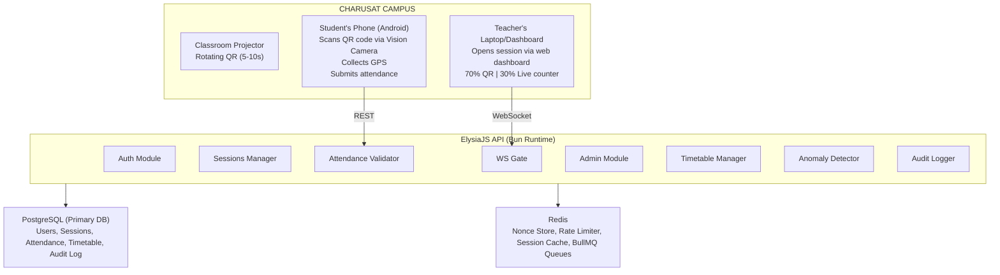
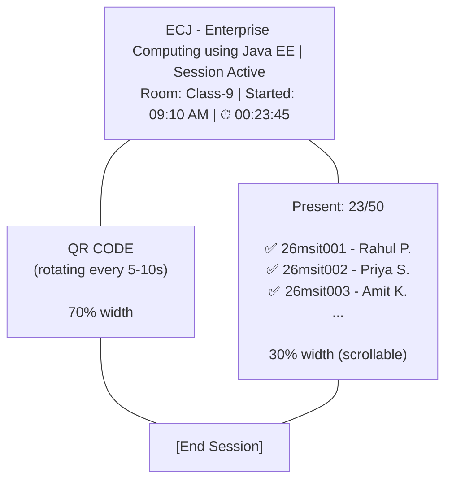
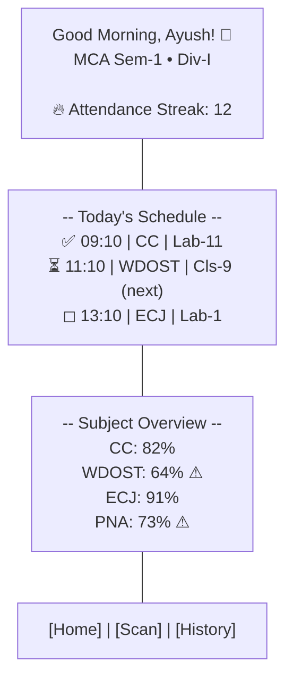

# Secured Attendance System — Architecture & Implementation Plan

> **Institution**: CHARUSAT (Charotar University of Science & Technology), Changa, Gujarat
> **Product Type**: Private, internal tool — full feature set, no time constraints
> **Stack**: ElysiaJS (Bun) · PostgreSQL · Redis · TanStack Router · Expo (React Native)

---

## Table of Contents

1. [System Overview](#1-system-overview)
2. [Role Model & Authentication](#2-role-model--authentication)
3. [Data Model (Prisma Schema)](#3-data-model-prisma-schema)
4. [Server Architecture (ElysiaJS)](#4-server-architecture-elysiajs)
5. [QR Token Design & Crypto](#5-qr-token-design--crypto)
6. [Attendance Validation Pipeline](#6-attendance-validation-pipeline)
7. [WebSocket Gateway](#7-websocket-gateway)
8. [Redis Architecture](#8-redis-architecture)
9. [Web Dashboard (Teacher + Admin)](#9-web-dashboard-teacher--admin)
10. [Native App (Student)](#10-native-app-student)
11. [Pluggable Security Modules](#11-pluggable-security-modules)
12. [GPS Geofencing](#12-gps-geofencing)
13. [Anomaly Detection & Audit](#13-anomaly-detection--audit)
14. [Deployment Architecture](#14-deployment-architecture)
15. [Phased Implementation Plan](#15-phased-implementation-plan)
16. [Code of Conduct & Standards](#16-code-of-conduct--standards)

---

## 1. System Overview



---

## 2. Role Model & Authentication

### 2.1 Dual Role System

Better Auth's organization plugin provides org-level roles via the `Member` model. System-wide roles (especially `super_admin`) exist **above** all organizations.

| Role | Scope | Access |
|------|-------|--------|
| `super_admin` | System-wide | Full system config, create admins, manage all orgs |
| `admin` | Organization (Program+Semester) | Manage timetable, rooms, students, teachers within their program |
| `teacher` | Organization (assigned programs) | Open/close sessions, view attendance for their classes |
| `student` | Organization (their program+semester) | **Mobile app only** — scan QR, view own attendance |

### 2.2 Organization Mapping

```
Organization = Program + Semester
Examples:
  - "MCA Sem-1" (slug: mca-sem-1)
  - "BCA Sem-3" (slug: bca-sem-3)
  - "BSc-IT Sem-1" (slug: bscit-sem-1)

Division = tag/group within an organization (stored on StudentProfile)
```

### 2.3 Email Domain Detection

| Pattern | Domain | Role |
|---------|--------|------|
| `26msit006@charusat.edu.in` | `charusat.edu.in` | Student |
| `tusharmehta.mca@charusat.ac.in` | `charusat.ac.in` | Teacher |

> [!NOTE]
> Admin creates ALL accounts. Email domain is used for validation, not self-registration.

### 2.4 Super Admin Bootstrap

Super admin credentials defined in `.env`:

```env
SUPER_ADMIN_EMAIL=admin@charusat.ac.in
SUPER_ADMIN_PASSWORD=<secure-password>
SUPER_ADMIN_NAME=System Administrator
```

On first server start, a seed script checks if this account exists; if not, creates it with `role: 'super_admin'` on the User model.

### 2.5 Student Onboarding Flow

```
1. Admin bulk-creates student accounts via CSV import
   CSV: enrollment_no, name, email, program_code, semester, division
   → System creates User + StudentProfile + assigns to Organization

2. Student downloads mobile app, logs in with email + temp password

3. First login triggers:
   a. Force password reset
   b. Device fingerprint capture (hardware ID, model, OS)
   c. Biometric setup (if device supports TouchID/FaceID)
   d. Device binding confirmed → student is "active"

4. If student tries to login from a DIFFERENT device:
   → Blocked. Must contact admin to re-bind device.
```

### 2.6 Enrollment Number Parsing

```
26msit006@charusat.edu.in
│ │    │
│ │    └─ Roll number: 006
│ └────── Program code: msit → M.Sc. IT
└──────── Admission year: 26 → 2026

Program code mapping (configurable by admin):
  msit → M.Sc. IT
  mca  → MCA
  bca  → BCA
  bscit → B.Sc. IT
```

Admin can override during CSV import if format is inconsistent.

---

## 3. Data Model (Prisma Schema)

### 3.1 Academic Hierarchy

```prisma
// packages/db/prisma/schema/academic.prisma

model AcademicYear {
  id        String   @id @default(uuid())
  name      String   // "2026-2027"
  startDate DateTime
  endDate   DateTime
  isCurrent Boolean  @default(false)
  createdAt DateTime @default(now())

  programs  ProgramSemester[]
  timetableEntries TimetableEntry[]
  sessions  AttendanceSession[]

  @@unique([name])
  @@map("academic_year")
}

model Program {
  id        String   @id @default(uuid())
  name      String   // "Master of Computer Applications"
  code      String   // "MCA"
  shortName String   // "MCA"
  createdAt DateTime @default(now())

  semesters ProgramSemester[]
  subjects  Subject[]

  @@unique([code])
  @@map("program")
}

model ProgramSemester {
  id             String   @id @default(uuid())
  programId      String
  program        Program  @relation(fields: [programId], references: [id])
  academicYearId String
  academicYear   AcademicYear @relation(fields: [academicYearId], references: [id])
  semester       Int      // 1, 2, 3...
  orgSlug        String   // "mca-sem-1-2026" → maps to Better Auth Organization

  divisions      Division[]
  timetableEntries TimetableEntry[]

  @@unique([programId, academicYearId, semester])
  @@map("program_semester")
}

model Division {
  id                String   @id @default(uuid())
  name              String   // "Div-I", "Div-II"
  programSemesterId String
  programSemester   ProgramSemester @relation(fields: [programSemesterId], references: [id])

  students          StudentProfile[]
  timetableEntries  TimetableEntry[]
  sessionDivisions  SessionDivision[]

  @@unique([programSemesterId, name])
  @@map("division")
}
```

### 3.2 User Profiles (extending Better Auth)

```prisma
// packages/db/prisma/schema/profiles.prisma

model StudentProfile {
  id            String   @id @default(uuid())
  userId        String   @unique
  user          User     @relation(fields: [userId], references: [id], onDelete: Cascade)
  enrollmentNo  String   @unique  // "26msit006"
  programCode   String   // "msit"
  admissionYear Int      // 2026
  rollNumber    String   // "006"
  divisionId    String?
  division      Division? @relation(fields: [divisionId], references: [id])

  // Device binding
  deviceId      String?  // Hardware fingerprint
  deviceModel   String?  // "Samsung Galaxy S24"
  deviceOs      String?  // "Android 15"
  deviceBound   Boolean  @default(false)
  deviceBoundAt DateTime?
  biometricEnabled Boolean @default(false)

  // Status
  status        String   @default("pending") // pending, active, suspended
  createdAt     DateTime @default(now())
  updatedAt     DateTime @updatedAt

  attendances   Attendance[]

  @@index([divisionId])
  @@map("student_profile")
}

model TeacherProfile {
  id          String   @id @default(uuid())
  userId      String   @unique
  user        User     @relation(fields: [userId], references: [id], onDelete: Cascade)
  code        String   @unique  // "HMP", "NV"
  department  String?  // "Computer Science"

  teachingAssignments TeachingAssignment[]
  sessions            AttendanceSession[]

  createdAt   DateTime @default(now())
  updatedAt   DateTime @updatedAt

  @@map("teacher_profile")
}

model TeachingAssignment {
  id               String   @id @default(uuid())
  teacherProfileId String
  teacherProfile   TeacherProfile @relation(fields: [teacherProfileId], references: [id])
  subjectId        String
  subject          Subject  @relation(fields: [subjectId], references: [id])
  divisionId       String
  division         Division @relation(fields: [divisionId], references: [id])

  @@unique([teacherProfileId, subjectId, divisionId])
  @@map("teaching_assignment")
}
```

> [!NOTE]
> Add relations to the existing `User` model in `auth.prisma`:
> ```prisma
> model User {
>   ...existing fields...
>   role            String   @default("student") // super_admin, admin, teacher, student
>   studentProfile  StudentProfile?
>   teacherProfile  TeacherProfile?
> }
> ```

### 3.3 Campus & Rooms

```prisma
// packages/db/prisma/schema/campus.prisma

model Building {
  id        String   @id @default(uuid())
  name      String   // "CMPICA Building"
  code      String   @unique // "CMPICA"
  gpsLat    Float    // 22.5966
  gpsLng    Float    // 72.8198
  radiusMeters Int   @default(100) // Geofence radius
  createdAt DateTime @default(now())

  rooms     Room[]

  @@map("building")
}

model Room {
  id          String   @id @default(uuid())
  name        String   // "Class-9"
  type        String   // "classroom", "lab", "auditorium", "tutorial_room"
  buildingId  String
  building    Building @relation(fields: [buildingId], references: [id])
  floor       Int?
  capacity    Int?

  // Future: WiFi + BLE
  bssidWhitelist String[] @default([])  // WiFi AP MACs
  beaconUuid     String?                // BLE beacon UUID

  timetableEntries TimetableEntry[]
  sessions         AttendanceSession[]
  createdAt        DateTime @default(now())

  @@unique([buildingId, name])
  @@map("room")
}
```

### 3.4 Subjects & Timetable

```prisma
// packages/db/prisma/schema/timetable.prisma

model Subject {
  id        String   @id @default(uuid())
  code      String   // "CAUC506"
  name      String   // "Enterprise Computing using Java EE"
  shortName String?  // "ECJ"
  programId String
  program   Program  @relation(fields: [programId], references: [id])
  createdAt DateTime @default(now())

  teachingAssignments TeachingAssignment[]
  timetableEntries    TimetableEntry[]
  sessions            AttendanceSession[]

  @@unique([code])
  @@map("subject")
}

model TimetableEntry {
  id                String   @id @default(uuid())
  programSemesterId String
  programSemester   ProgramSemester @relation(fields: [programSemesterId], references: [id])
  academicYearId    String
  academicYear      AcademicYear @relation(fields: [academicYearId], references: [id])
  subjectId         String
  subject           Subject  @relation(fields: [subjectId], references: [id])
  roomId            String
  room              Room     @relation(fields: [roomId], references: [id])
  dayOfWeek         Int      // 0=Monday, 1=Tuesday, ... 5=Saturday
  startTime         String   // "09:10" (HH:mm)
  endTime           String   // "10:10"
  type              String   @default("lecture") // lecture, lab, tutorial
  teacherCodes      String[] // ["HMP", "NV"] — multiple teachers possible

  // Divisions attending this entry (for combined/shared classes)
  divisions         TimetableEntryDivision[]

  createdAt         DateTime @default(now())

  @@map("timetable_entry")
}

model TimetableEntryDivision {
  id               String   @id @default(uuid())
  timetableEntryId String
  timetableEntry   TimetableEntry @relation(fields: [timetableEntryId], references: [id], onDelete: Cascade)
  divisionId       String
  division         Division @relation(fields: [divisionId], references: [id])

  @@unique([timetableEntryId, divisionId])
  @@map("timetable_entry_division")
}
```

### 3.5 Sessions & Attendance

```prisma
// packages/db/prisma/schema/attendance.prisma

model AttendanceSession {
  id               String   @id @default(uuid())
  academicYearId   String
  academicYear     AcademicYear @relation(fields: [academicYearId], references: [id])
  subjectId        String
  subject          Subject  @relation(fields: [subjectId], references: [id])
  roomId           String
  room             Room     @relation(fields: [roomId], references: [id])
  teacherProfileId String
  teacherProfile   TeacherProfile @relation(fields: [teacherProfileId], references: [id])

  // Session timing (teacher-controlled)
  startTime        DateTime
  endTime          DateTime
  status           String   @default("active") // active, closed
  closedAt         DateTime?

  // Security
  sessionSecret    Bytes    // HKDF-derived per-session signing key

  // Divisions attending (for combined classes)
  sessionDivisions SessionDivision[]

  attendances      Attendance[]
  qrTokens         QrToken[]

  createdAt        DateTime @default(now())

  @@map("attendance_session")
}

model SessionDivision {
  id         String   @id @default(uuid())
  sessionId  String
  session    AttendanceSession @relation(fields: [sessionId], references: [id], onDelete: Cascade)
  divisionId String
  division   Division @relation(fields: [divisionId], references: [id])

  @@unique([sessionId, divisionId])
  @@map("session_division")
}

model QrToken {
  id        String   @id @default(uuid())
  sessionId String
  session   AttendanceSession @relation(fields: [sessionId], references: [id], onDelete: Cascade)
  nonce     String   // base64url(16 random bytes)
  issuedAt  DateTime
  expiresAt DateTime
  usedAt    DateTime?
  usedBy    String?  // studentProfileId

  @@unique([sessionId, nonce])
  @@index([sessionId])
  @@map("qr_token")
}

model Attendance {
  id               String   @id @default(uuid())
  studentProfileId String
  studentProfile   StudentProfile @relation(fields: [studentProfileId], references: [id])
  sessionId        String
  session          AttendanceSession @relation(fields: [sessionId], references: [id])

  // Submitted data
  timestamp        DateTime @default(now())
  gpsLat           Float?
  gpsLng           Float?
  bssidSeen        String?
  beaconRssi       Int?

  // Verification results
  gpsWithinGeofence  Boolean @default(false)
  bssidValid         Boolean?
  beaconValid        Boolean?
  integrityPass      Boolean?
  mockLocationFlag   Boolean @default(false)
  livenessScore      Float?

  // Anomaly tracking
  anomalyFlags       String[] @default([])

  @@unique([studentProfileId, sessionId])
  @@index([sessionId])
  @@index([studentProfileId])
  @@map("attendance")
}
```

### 3.6 Audit Log

```prisma
// packages/db/prisma/schema/audit.prisma

model AuditLog {
  id        String   @id @default(uuid())
  eventType String   // "session.opened", "attendance.submitted", "attendance.rejected", "device.rebound"
  actor     String?  // userId
  actorRole String?  // "teacher", "student", "admin"
  targetId  String?  // affected entity ID
  details   Json?    // additional context
  ipAddress String?
  userAgent String?
  timestamp DateTime @default(now())

  @@index([eventType])
  @@index([actor])
  @@index([timestamp])
  @@map("audit_log")
}
```

---

## 4. Server Architecture (ElysiaJS)

### 4.1 Module Structure

```
apps/server/src/
├── index.ts                    # Entry point, mount all modules
├── modules/
│   ├── auth/
│   │   ├── index.ts            # Auth routes (Better Auth handler)
│   │   ├── guards.ts           # Role-based middleware (requireRole, requireAuth)
│   │   ├── seed.ts             # Super admin seed on startup
│   │   └── device-binding.ts   # Device fingerprint binding logic
│   ├── admin/
│   │   ├── index.ts            # Admin routes group
│   │   ├── users.ts            # User management (CRUD, bulk import)
│   │   ├── programs.ts         # Program/semester/division CRUD
│   │   ├── buildings.ts        # Building + room CRUD
│   │   ├── subjects.ts         # Subject CRUD
│   │   ├── teachers.ts         # Teacher profile + assignment management
│   │   ├── timetable.ts        # Timetable CRUD + CSV import
│   │   ├── academic-year.ts    # Academic year management
│   │   └── import.ts           # CSV/JSON bulk import handler
│   ├── sessions/
│   │   ├── index.ts            # Session routes
│   │   ├── lifecycle.ts        # Open/close session logic
│   │   ├── qr-generator.ts     # QR token generation + rotation
│   │   └── auto-close.ts       # Auto-close expired sessions
│   ├── attendance/
│   │   ├── index.ts            # POST /attendance/submit
│   │   ├── pipeline.ts         # 11-step validation pipeline
│   │   ├── geofence.ts         # Haversine distance calculation
│   │   └── reports.ts          # Attendance reports/analytics endpoints
│   ├── ws/
│   │   ├── index.ts            # WebSocket gateway
│   │   ├── qr-broadcast.ts     # Rotating QR token broadcast to teacher
│   │   └── live-feed.ts        # Live attendance feed to teacher/admin
│   ├── anomaly/
│   │   ├── index.ts            # Anomaly detection routes
│   │   ├── impossible-travel.ts # Time/distance check
│   │   └── detector.ts         # Anomaly scoring engine
│   └── audit/
│       ├── index.ts            # Audit log routes (admin only)
│       └── logger.ts           # Async audit log writer (via BullMQ)
├── lib/
│   ├── crypto.ts               # HMAC-SHA256, HKDF, token signing
│   ├── redis.ts                # Redis connections (attendance + BullMQ)
│   ├── logger.ts               # Winston logger (existing)
│   ├── queue.ts                # BullMQ queues (refactored)
│   ├── workers.ts              # BullMQ workers (refactored)
│   └── storage.ts              # Cloudinary (existing)
└── plugins/
    ├── ble-check.ts            # Pluggable BLE beacon verification
    ├── bssid-check.ts          # Pluggable WiFi BSSID verification
    ├── integrity-check.ts      # Pluggable device integrity (Play Integrity/App Attest)
    └── liveness-check.ts       # Pluggable liveness selfie verification
```

### 4.2 Key API Endpoints

#### Auth Module
| Method | Path | Role | Description |
|--------|------|------|-------------|
| ALL | `/api/auth/*` | Public | Better Auth handler |
| POST | `/api/auth/device-bind` | Student | Bind device fingerprint on first login |
| POST | `/api/auth/device-rebind` | Admin | Admin re-binds a student's device |

#### Admin Module
| Method | Path | Role | Description |
|--------|------|------|-------------|
| GET/POST | `/api/admin/users` | Admin+ | List/create users |
| POST | `/api/admin/users/bulk-import` | Admin+ | CSV bulk import students/teachers |
| GET/POST | `/api/admin/programs` | Admin+ | Program CRUD |
| GET/POST | `/api/admin/buildings` | Admin+ | Building + GPS CRUD |
| GET/POST | `/api/admin/rooms` | Admin+ | Room CRUD |
| GET/POST | `/api/admin/subjects` | Admin+ | Subject CRUD |
| GET/POST | `/api/admin/timetable` | Admin+ | Timetable CRUD + CSV import |
| POST | `/api/admin/timetable/import` | Admin+ | Structured CSV/JSON timetable import |

#### Session Module
| Method | Path | Role | Description |
|--------|------|------|-------------|
| GET | `/api/sessions/today` | Teacher | Get teacher's sessions for today (from timetable) |
| POST | `/api/sessions/open` | Teacher | Open a session (start QR rotation) |
| POST | `/api/sessions/:id/close` | Teacher | Close a session |
| GET | `/api/sessions/:id/attendance` | Teacher | Get live attendance for session |

#### Attendance Module
| Method | Path | Role | Description |
|--------|------|------|-------------|
| POST | `/api/attendance/submit` | Student | Submit attendance scan |
| GET | `/api/attendance/my` | Student | Student's own attendance history |
| GET | `/api/attendance/my/:subjectId` | Student | Per-subject attendance detail |
| GET | `/api/attendance/report/:sessionId` | Teacher+ | Session attendance report |
| GET | `/api/attendance/report/subject/:subjectId` | Teacher+ | Subject-wide report |
| GET | `/api/attendance/export/:format` | Admin+ | Export CSV/PDF |

#### Anomaly Module
| Method | Path | Role | Description |
|--------|------|------|-------------|
| GET | `/api/anomalies` | Admin+ | List anomaly alerts |
| GET | `/api/anomalies/student/:id` | Admin+ | Student's anomaly history |
| POST | `/api/anomalies/:id/resolve` | Admin+ | Mark anomaly as reviewed |

---

## 5. QR Token Design & Crypto

### 5.1 Token Payload

```json
{
  "sid": "session-uuid",
  "nonce": "base64url(16 random bytes)",
  "iat": 1755400000,
  "exp": 1755400010
}
```

### 5.2 Signing (Bun built-in crypto)

```typescript
// apps/server/src/lib/crypto.ts

import { createHmac } from "node:crypto";

// Master secret from env
const MASTER_SECRET = Buffer.from(process.env.QR_SIGNING_SECRET!, "base64");

/**
 * Derive a per-session signing key using HKDF
 * So a leaked session key doesn't compromise other sessions
 */
export function deriveSessionKey(sessionId: string): Buffer {
  const hmac = createHmac("sha256", MASTER_SECRET);
  hmac.update(`session:${sessionId}`);
  return hmac.digest();
}

/**
 * Generate a signed QR token
 */
export function generateQrToken(sessionId: string, sessionKey: Buffer): {
  token: string;
  nonce: string;
  issuedAt: number;
  expiresAt: number;
} {
  const nonce = Buffer.from(crypto.getRandomValues(new Uint8Array(16)))
    .toString("base64url");
  const iat = Math.floor(Date.now() / 1000);
  const exp = iat + 10; // 10-second TTL

  const payload = JSON.stringify({ sid: sessionId, nonce, iat, exp });
  const payloadB64 = Buffer.from(payload).toString("base64url");

  const hmac = createHmac("sha256", sessionKey);
  hmac.update(payloadB64);
  const signature = hmac.digest("base64url");

  return {
    token: `${payloadB64}.${signature}`,
    nonce,
    issuedAt: iat,
    expiresAt: exp,
  };
}

/**
 * Verify and parse a QR token
 */
export function verifyQrToken(
  token: string,
  sessionKey: Buffer
): { valid: true; payload: QrPayload } | { valid: false; reason: string } {
  const [payloadB64, signature] = token.split(".");
  if (!payloadB64 || !signature) return { valid: false, reason: "malformed" };

  // Verify HMAC
  const hmac = createHmac("sha256", sessionKey);
  hmac.update(payloadB64);
  const expected = hmac.digest("base64url");

  if (signature !== expected) return { valid: false, reason: "invalid_signature" };

  // Parse payload
  const payload = JSON.parse(
    Buffer.from(payloadB64, "base64url").toString()
  ) as QrPayload;

  // Check expiry against server time
  const now = Math.floor(Date.now() / 1000);
  if (now > payload.exp) return { valid: false, reason: "expired" };

  return { valid: true, payload };
}
```

### 5.3 QR Content

The token string (`base64url(payload).base64url(hmac)`) is encoded directly into the QR code. No JWT headers or algorithm negotiation — intentionally minimal to avoid JWT algorithm-confusion vulnerabilities.

---

## 6. Attendance Validation Pipeline

```
POST /attendance/submit
{
  token: "<qr_token>",
  gps: { lat: number, lng: number, mockFlag: boolean },
  deviceId: string,
  bssidSeen?: string,        // optional (future)
  beacon?: { uuid, rssi },   // optional (future)
  integrityToken?: string,    // optional (future)
  livenessScore?: number      // optional (future)
}
```

### Validation Steps (fail-fast, cheapest first)

| Step | Check | Action on Fail | Anomaly Flag |
|------|-------|----------------|--------------|
| 1 | Parse + verify HMAC signature | Reject | — |
| 2 | Check `exp` against server clock | Reject ("QR expired") | — |
| 3 | Nonce check: Redis `GETDEL nonce:{sid}:{nonce}` | Reject ("Already used") | `duplicate_scan` |
| 4 | Student exists + device bound | Reject | `unbound_device` |
| 5 | Device ID matches bound device | Reject | `wrong_device` |
| 6 | Mock location flag | Reject ("Location error") | `mock_location` |
| 7 | GPS geofence (haversine vs building radius) | Reject ("Location error") | `gps_outside_geofence` |
| 8 | **[Pluggable]** WiFi BSSID check | Flag only | `bssid_mismatch` |
| 9 | **[Pluggable]** BLE beacon proximity | Flag only | `beacon_not_detected` |
| 10 | **[Pluggable]** Device integrity | Flag only | `integrity_failed` |
| 11 | Impossible travel check | Flag (don't reject) | `impossible_travel` |
| 12 | Insert attendance row (unique constraint) | Reject ("Already marked") | `duplicate_scan` |
| 13 | **Async**: audit log, WS live feed update | — | — |

> [!IMPORTANT]
> Client-facing error messages are **generic categories** (location error, QR expired, already marked). The specific failed check is logged server-side only for the admin audit dashboard.

### Haversine Distance (Step 7)

```typescript
// apps/server/src/modules/attendance/geofence.ts

export function haversineDistance(
  lat1: number, lng1: number,
  lat2: number, lng2: number
): number {
  const R = 6371e3; // Earth's radius in meters
  const φ1 = (lat1 * Math.PI) / 180;
  const φ2 = (lat2 * Math.PI) / 180;
  const Δφ = ((lat2 - lat1) * Math.PI) / 180;
  const Δλ = ((lng2 - lng1) * Math.PI) / 180;

  const a = Math.sin(Δφ / 2) ** 2 +
    Math.cos(φ1) * Math.cos(φ2) * Math.sin(Δλ / 2) ** 2;

  return R * 2 * Math.atan2(Math.sqrt(a), Math.sqrt(1 - a));
}

export function isWithinGeofence(
  studentLat: number, studentLng: number,
  buildingLat: number, buildingLng: number,
  radiusMeters: number
): boolean {
  return haversineDistance(studentLat, studentLng, buildingLat, buildingLng) <= radiusMeters;
}
```

---

## 7. WebSocket Gateway

### 7.1 Elysia WebSocket Setup

```typescript
// apps/server/src/modules/ws/index.ts

app.ws("/ws/session/:sessionId", {
  // Teacher connects to receive rotating QR tokens
  open(ws) {
    // Verify teacher auth + session ownership
    // Subscribe to session room
    ws.subscribe(`session:${ws.data.params.sessionId}`);
  },
  message(ws, message) {
    // Handle teacher commands (close session, etc.)
  },
  close(ws) {
    ws.unsubscribe(`session:${ws.data.params.sessionId}`);
  },
});

app.ws("/ws/admin/live", {
  // Admin connects to receive live attendance events across all sessions
  open(ws) {
    // Verify admin auth
    ws.subscribe("admin:live");
  },
});
```

### 7.2 QR Rotation Flow

```
1. Teacher opens session → server creates session in DB + Redis
2. Server starts interval timer (5-10s) for this session
3. Every tick:
   a. Generate new QR token (nonce + HMAC sign)
   b. Store nonce in Redis: SET nonce:{sid}:{nonce} "unused" EX 10
   c. Broadcast token to ws room `session:{sid}`
4. Teacher's browser receives token → renders as QR code on screen
5. On session close → clear interval, clean up Redis
```

### 7.3 Live Attendance Feed

When a student successfully scans:
1. Insert attendance row
2. Publish to WS room `session:{sid}`:
   ```json
   { "type": "attendance_marked", "student": "name", "enrollmentNo": "26msit006", "count": 23, "total": 50 }
   ```
3. Publish to `admin:live` for admin dashboard

---

## 8. Redis Architecture

### 8.1 Dual Connection

```typescript
// apps/server/src/lib/redis.ts

import { Redis } from "ioredis";

// Connection 1: Attendance operations (nonce, rate-limit, session cache)
export const attendanceRedis = new Redis({
  host: process.env.REDIS_HOST,
  port: Number(process.env.REDIS_PORT),
  password: process.env.REDIS_PASSWORD,
  keyPrefix: "att:",
});

// Connection 2: BullMQ (existing, uses its own connection)
// Already defined in lib/queue.ts
```

### 8.2 Key Design

| Key Pattern | Type | TTL | Purpose |
|-------------|------|-----|---------|
| `att:nonce:{sid}:{nonce}` | string | 10s | Single-use QR nonce (replay protection) |
| `att:session:{sid}` | hash | session duration | Hot cache: room GPS, radius, BSSID list, beacon UUID |
| `att:ratelimit:{studentId}` | string (counter) | 60s | Max 5 scan attempts/minute per student |
| `att:device:{deviceId}:last` | hash | 24h | Last attendance: timestamp, roomId, GPS (for impossible-travel) |
| `att:session:{sid}:count` | string (counter) | session duration | Quick attendance count (avoid DB query for live counter) |

### 8.3 Nonce Check (Atomic Lua Script)

```lua
-- Check and consume nonce atomically
-- Returns 1 if valid and consumed, 0 if already used/expired
local key = KEYS[1]
local val = redis.call('GET', key)
if val == 'unused' then
  redis.call('DEL', key)
  return 1
end
return 0
```

---

## 9. Web Dashboard (Teacher + Admin)

### 9.1 Route Structure

```
apps/web/src/routes/
├── __root.tsx                   # Root layout (auth check)
├── index.tsx                    # Landing/redirect
├── login.tsx                    # Login page
├── teacher/
│   ├── __layout.tsx             # Teacher layout (sidebar + header)
│   ├── index.tsx                # Teacher dashboard (today's classes)
│   ├── session/
│   │   └── $sessionId.tsx       # Active session: QR display + live attendance
│   ├── attendance/
│   │   ├── index.tsx            # Attendance history (all subjects)
│   │   └── $subjectId.tsx       # Per-subject attendance detail
│   └── profile.tsx              # Teacher profile
├── admin/
│   ├── __layout.tsx             # Admin layout
│   ├── index.tsx                # Admin dashboard (overview stats)
│   ├── users/
│   │   ├── index.tsx            # User management
│   │   ├── import.tsx           # Bulk CSV import
│   │   └── $userId.tsx          # User detail / device management
│   ├── academic/
│   │   ├── programs.tsx         # Program management
│   │   ├── semesters.tsx        # Semester/division management
│   │   └── subjects.tsx         # Subject management
│   ├── campus/
│   │   ├── buildings.tsx        # Building management + map
│   │   └── rooms.tsx            # Room management
│   ├── timetable/
│   │   ├── index.tsx            # Timetable view/edit
│   │   └── import.tsx           # Timetable CSV import
│   ├── attendance/
│   │   ├── index.tsx            # Attendance reports
│   │   ├── map.tsx              # shadcn-map: student GPS visualization
│   │   └── export.tsx           # Export CSV/PDF
│   ├── anomalies/
│   │   └── index.tsx            # Anomaly alerts dashboard
│   ├── audit/
│   │   └── index.tsx            # Audit log viewer
│   └── settings.tsx             # System settings
```

### 9.2 Teacher QR Display Page Layout



### 9.3 Admin Building Map (shadcn-map)

Admin configures buildings by placing pins on the map:
- Click on map → set building coordinates
- Drag radius circle → set geofence boundary
- View in attendance reports: student GPS dots plotted on map after session ends

---

## 10. Native App (Student)

### 10.1 Navigation Structure

```
apps/native/app/
├── _layout.tsx                  # Root: GestureHandler + Providers
├── (auth)/
│   ├── _layout.tsx              # Auth flow layout
│   ├── login.tsx                # Login screen
│   ├── reset-password.tsx       # First-login password reset
│   └── device-binding.tsx       # Device registration + biometric setup
├── (main)/
│   ├── _layout.tsx              # Bottom tabs + Drawer
│   ├── (tabs)/
│   │   ├── _layout.tsx          # Bottom tab bar
│   │   ├── index.tsx            # Home: today's schedule, streak, overview
│   │   ├── scan.tsx             # QR Scanner (Vision Camera)
│   │   └── history.tsx          # Attendance history + per-subject view
│   ├── (drawer)/
│   │   ├── _layout.tsx          # Drawer menu
│   │   ├── profile.tsx          # Student profile + device info
│   │   ├── subjects.tsx         # Subject-wise attendance breakdown
│   │   └── settings.tsx         # App settings
│   └── attendance-detail.tsx    # Subject attendance detail (full view)
```

### 10.2 QR Scanner Flow

```
1. Student opens Scan tab → Vision Camera activates
2. Camera detects QR code → decode token string
3. App simultaneously collects:
   a. GPS coordinates (expo-location)
   b. Mock location flag
   c. Device ID (hardware fingerprint)
   d. [Future] WiFi BSSID
   e. [Future] BLE beacon scan
   f. [Future] Device integrity token
4. Assemble payload → POST /attendance/submit
5. On success:
   - Green checkmark animation + haptic feedback
   - Show: "✅ Attendance Marked — ECJ — 78% overall"
6. On failure:
   - Red animation + specific-but-safe error message
   - "Location verification failed" / "QR expired" / "Already marked"
```

### 10.3 Device Binding Flow

```
1. First login → server detects no device bound
2. App collects:
   - Device model, OS version
   - Unique device ID (Application.androidId or similar)
   - Biometric capability check
3. POST /api/auth/device-bind with device info
4. If device supports biometrics:
   - Prompt biometric enrollment (TouchID/FaceID)
   - Store biometric preference
5. If no biometric support:
   - Skip biometric, rely on device binding + PIN/password only
6. Server records device fingerprint → student status: "active"
```

### 10.4 Student Home Screen



---

## 11. Pluggable Security Modules

Each security check beyond GPS is implemented as a **pluggable module** with a standard interface:

```typescript
// apps/server/src/plugins/types.ts

export interface SecurityCheckPlugin {
  name: string;
  enabled: boolean;
  priority: number; // Lower = checked first

  /**
   * Returns { pass: true } or { pass: false, flag: string }
   */
  check(context: {
    studentProfile: StudentProfile;
    session: AttendanceSession;
    submission: AttendanceSubmission;
    room: Room;
    building: Building;
  }): Promise<{ pass: true } | { pass: false; flag: string }>;
}
```

### Available Plugins

| Plugin | File | Status | Description |
|--------|------|--------|-------------|
| GPS Geofence | `geofence.ts` | **Active** | Haversine distance check |
| WiFi BSSID | `bssid-check.ts` | **Stub** | Match against room whitelist |
| BLE Beacon | `ble-check.ts` | **Stub** | UUID + RSSI threshold |
| Device Integrity | `integrity-check.ts` | **Stub** | Play Integrity / App Attest |
| Liveness | `liveness-check.ts` | **Stub** | Face match against enrollment photo |

Plugins are registered in config and loaded dynamically:

```typescript
const plugins: SecurityCheckPlugin[] = [
  new GpsGeofencePlugin(),       // Always enabled
  new BssidCheckPlugin(),         // Enabled when room has BSSID data
  new BleBeaconPlugin(),          // Enabled when room has beacon UUID
  new IntegrityCheckPlugin(),     // Enabled when API keys configured
  new LivenessCheckPlugin(),      // Enabled when feature flag on
];
```

---

## 12. GPS Geofencing

### 12.1 Admin Configuration Flow

```
1. Admin opens Campus → Buildings page
2. shadcn-map loads with satellite view of CHARUSAT campus
3. Admin clicks on map → places pin at building location
4. Admin drags radius handle → sets geofence boundary (50m, 100m, 200m)
5. Building created with: name, code, GPS coordinates, radius
6. Admin then adds rooms to this building
```

### 12.2 Runtime Check

```
Student scans QR → session has room → room has building → building has GPS + radius
→ haversine(student GPS, building GPS) <= building.radiusMeters
→ pass/fail
```

---

## 13. Anomaly Detection & Audit

### 13.1 Anomaly Types

| Flag | Trigger | Severity |
|------|---------|----------|
| `duplicate_scan` | Same student, same session, second attempt | Low |
| `gps_outside_geofence` | GPS > building radius | Medium |
| `mock_location` | Android `isFromMockProvider` = true | High |
| `wrong_device` | Device ID doesn't match bound device | Critical |
| `unbound_device` | No device bound to student | Critical |
| `impossible_travel` | Two locations too fast (< walking speed) | High |
| `bssid_mismatch` | Wrong WiFi AP (when enabled) | Medium |
| `beacon_not_detected` | BLE beacon not found (when enabled) | Medium |
| `integrity_failed` | Rooted/emulator/tampered app | Critical |
| `rate_limit_exceeded` | > 5 attempts/minute | Medium |

### 13.2 Impossible Travel Detection

```typescript
// Check if student could physically travel between two locations in the elapsed time
const MAX_WALK_SPEED_MS = 1.4; // 1.4 m/s = average walking speed
const distance = haversineDistance(lastLat, lastLng, currentLat, currentLng);
const timeDiffSeconds = (currentTime - lastTime) / 1000;
const maxPossibleDistance = timeDiffSeconds * MAX_WALK_SPEED_MS;

if (distance > maxPossibleDistance) {
  anomalyFlags.push("impossible_travel");
}
```

### 13.3 Audit Logging (Async via BullMQ)

Every security-relevant event is queued for async logging:

```typescript
await auditQueue.add("log", {
  eventType: "attendance.rejected",
  actor: studentProfile.userId,
  actorRole: "student",
  targetId: session.id,
  details: {
    failedCheck: "gps_outside_geofence",
    submittedGps: { lat, lng },
    expectedBuilding: building.name,
    distance: calculatedDistance,
    allowedRadius: building.radiusMeters,
  },
});
```

### 13.4 Admin Anomaly Dashboard

- Real-time list of anomaly alerts (sorted by severity)
- Filter by: type, student, date range, program
- Each alert shows: student, session, failed check details, GPS on map
- Admin can mark as: reviewed, false-positive, escalated

---

## 14. Deployment Architecture

### 14.1 Docker Compose (Production)

```yaml
services:
  server:
    build: ./apps/server
    ports: ["3001:3000"]
    depends_on: [postgres, redis]
    environment:
      - DATABASE_URL=postgresql://...
      - REDIS_HOST=redis

  web:
    build: ./apps/web
    ports: ["3000:3000"]
    depends_on: [server]

  postgres:
    image: postgres:16-alpine
    volumes: [postgres_data:/var/lib/postgresql/data]

  redis:
    image: redis:7.2-alpine
    command: redis-server --appendonly yes
    volumes: [redis_data:/data]

  caddy:  # Reverse proxy + TLS
    image: caddy:2-alpine
    ports: ["80:80", "443:443"]
    volumes: [./Caddyfile:/etc/caddy/Caddyfile]
```

### 14.2 VPS Requirements (DigitalOcean/Hetzner)

- **Minimum**: 2 vCPU, 4GB RAM, 40GB SSD
- **Recommended**: 4 vCPU, 8GB RAM, 80GB SSD
- OS: Ubuntu 24.04 LTS

### 14.3 Mobile App Distribution

- **EAS Build**: Custom dev client for Android
- **APK**: Direct APK distribution to students (via college portal/WhatsApp)
- **Future**: Google Play internal testing track

---

## 15. Phased Implementation Plan

### Phase 1: Foundation & Data Model (Backend Core)

> [!IMPORTANT]
> All Phase 1 work must be complete before any other phase begins.

#### Tasks
- [x] Extend Prisma schema with all domain models (academic, campus, timetable, attendance, audit)
- [x] Run migrations, verify schema
- [x] Add `role` field to User model
- [x] Super admin seed script (from .env)
- [x] Redis dual-connection setup (attendance Redis + BullMQ Redis)
- [x] Crypto utilities: HMAC-SHA256, HKDF session key derivation
- [x] Server env updates: QR_SIGNING_SECRET, REDIS config
- [x] Refactor BullMQ queues/workers for audit logging

---

### Phase 2: Auth & User Management

#### Tasks
- [x] Auth guards/middleware: `requireAuth`, `requireRole(roles[])`
- [x] Device binding endpoint + logic
- [x] Admin user CRUD API (create, list, update, suspend)
- [x] CSV bulk import API for students (parse enrollment_no, auto-detect program)
- [x] CSV bulk import API for teachers (with code/initials)
- [x] Admin web UI: User management page
- [x] Admin web UI: Bulk import page (file upload + preview + confirm)
- [x] Device re-binding admin endpoint

---

### Phase 3: Academic Structure & Timetable

#### Tasks
- [x] Academic year CRUD API
- [x] Program CRUD API
- [x] Program semester + division CRUD API
- [x] Subject CRUD API
- [x] Building CRUD API (with GPS coordinates + radius)
- [x] Room CRUD API
- [x] Teacher profile + teaching assignment CRUD API
- [x] Timetable CRUD API
- [x] Timetable CSV/JSON import API (parse your actual timetable format)
- [x] Admin web UI: Academic management pages (programs, semesters, divisions)
- [x] Admin web UI: Campus page (buildings + rooms + shadcn-map for GPS)
- [x] Admin web UI: Subject management
- [x] Admin web UI: Timetable management + import

---

### Phase 4: Session & QR System (Core Feature)

#### Tasks
- [ ] Session lifecycle: open, close, auto-expire
- [ ] QR token generation + HMAC signing
- [ ] WebSocket gateway for QR rotation broadcast
- [ ] Teacher API: "today's classes" from timetable
- [ ] Teacher web UI: Dashboard (today's scheduled classes, one-click start)
- [ ] Teacher web UI: Active session page (QR display 70% + live counter 30%)
- [ ] QR code rendering (use `qrcode` library, render as SVG for crisp projector display)
- [ ] WebSocket client in teacher dashboard (receive + display rotating QR)
- [ ] Live attendance counter (WebSocket feed)
- [ ] Session close UI + auto-close logic

---

### Phase 5: Attendance Submission & Validation (Mobile App)

#### Tasks
- [ ] Expo custom dev client setup (prebuild for Android)
- [ ] Install + configure react-native-vision-camera + code-scanner
- [ ] QR scanner screen (camera view + decode)
- [ ] GPS collection module (expo-location)
- [ ] Mock location detection
- [ ] Device fingerprint collection
- [ ] Attendance submission REST endpoint (full 11-step pipeline)
- [ ] Geofence haversine check
- [ ] Redis nonce store + atomic check-and-consume
- [ ] Rate limiting per student
- [ ] Success UX: green animation + attendance % + haptic
- [ ] Failure UX: safe error messages
- [ ] Student home screen (today's schedule, streak, subject overview)
- [ ] Student attendance history screen (per-subject breakdown)
- [ ] Device binding flow (first login)
- [ ] Biometric setup (when available)
- [ ] Offline handling (queue submission, retry on connectivity)
- [ ] Navigation restructure: bottom tabs (Home, Scan, History) + drawer (Profile, Settings)

---

### Phase 6: Reports, Analytics & Map

#### Tasks
- [ ] Attendance report API: per-session, per-subject, per-student
- [ ] Total percentage calculation per student per subject
- [ ] Below-threshold alerts (< 75% attendance warning)
- [ ] CSV export endpoint
- [ ] PDF export endpoint (use a PDF library or server-side rendering)
- [ ] Teacher web UI: Attendance reports page
- [ ] Teacher web UI: Per-session student list with status
- [ ] Admin web UI: shadcn-map page (post-session GPS visualization)
- [ ] Admin web UI: Program-wide attendance analytics
- [ ] Admin web UI: Export page (CSV/PDF download)

---

### Phase 7: Anomaly Detection, Audit & Polish

#### Tasks
- [ ] Impossible travel detection logic
- [ ] Anomaly scoring engine
- [ ] Anomaly alert persistence + API
- [ ] Admin anomaly dashboard UI (real-time alerts, filter, resolve)
- [ ] Audit log writer (BullMQ async)
- [ ] Audit log viewer UI (filterable, searchable)
- [ ] Pluggable module stubs: BLE, BSSID, Integrity, Liveness (interfaces + config flags)
- [ ] Admin system settings page (geofence defaults, QR rotation interval, rate limits)
- [ ] Student-facing: attendance streak feature
- [ ] Performance optimization (DB indexes, Redis caching)
- [ ] End-to-end testing
- [ ] Docker Compose production config
- [ ] Deployment documentation

---

## 16. Code of Conduct & Standards

### 16.1 Project Structure Rules

- **Monorepo packages** are the source of truth:
  - `@secured_attendance/db` — ALL Prisma models, client export
  - `@secured_attendance/auth` — Better Auth configuration
  - `@secured_attendance/env` — Type-safe env validation
- **Never import directly across app boundaries** — use packages
- Server modules use Elysia `.group()` + `.guard()` for route grouping

### 16.2 Coding Standards

- **TypeScript strict mode** — no `any`, no implicit returns
- **Zod for all API validation** — every endpoint has a Zod schema
- **Prisma for all DB access** — no raw SQL unless absolutely necessary
- **Error handling**: Elysia `error()` for HTTP errors, never throw raw errors
- **Logging**: Use Winston logger for all server-side logs, never `console.log` in production code
- **Naming**: camelCase for variables/functions, PascalCase for types/models, kebab-case for files
- **File length**: Max 300 lines per file — split into modules

### 16.3 Security Standards

- **Never trust client input** — re-validate everything server-side
- **Never leak security check details** to the client
- **Nonce is single-use** — atomic check-and-consume (Redis Lua script)
- **Session secrets are per-session** — derived via HKDF, never reuse master key directly
- **Rate limit everything** — scan attempts, login attempts, API calls
- **Audit everything** — every security-relevant event gets an audit log entry
- **Device binding is mandatory** — no attendance without bound device

### 16.4 Git Conventions

- **Branch naming**: `feature/phase-X-name`, `fix/description`, `chore/description`
- **Commit messages**: Conventional Commits (`feat:`, `fix:`, `chore:`, `refactor:`)
- **PR scope**: One phase or sub-feature per PR — no mega-PRs

### 16.5 Testing Strategy

- **Unit tests**: Validation pipeline steps, crypto functions, geofence calculations
- **Integration tests**: API endpoints with test database
- **E2E (manual)**: Full flow from session open → QR scan → attendance recorded
- **Framework**: Vitest (already configured)
