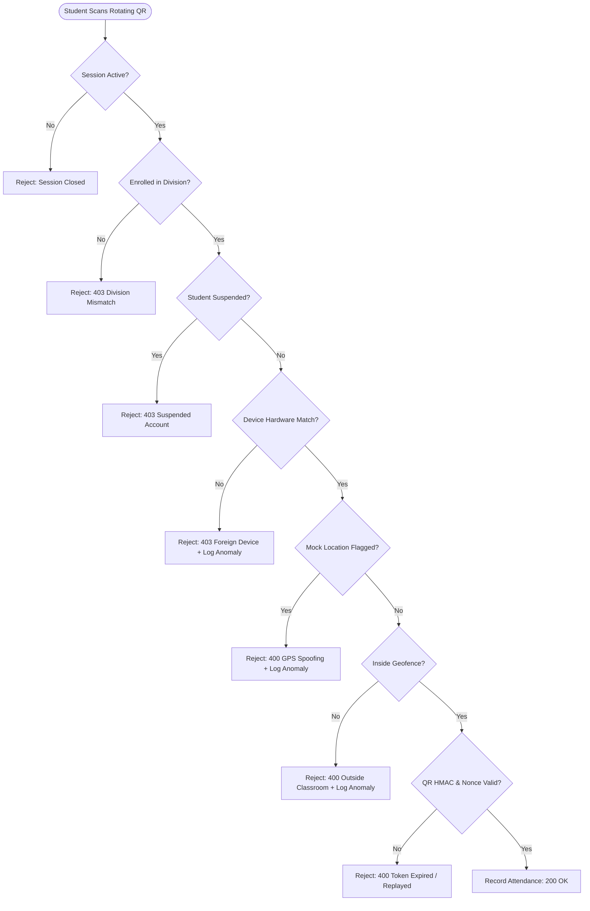
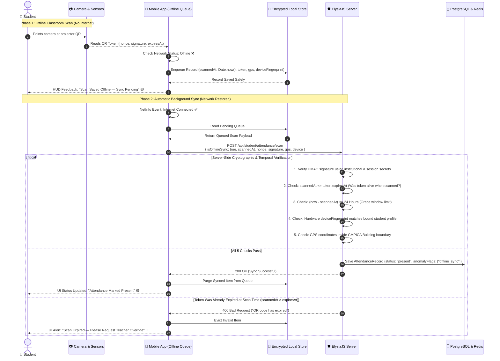
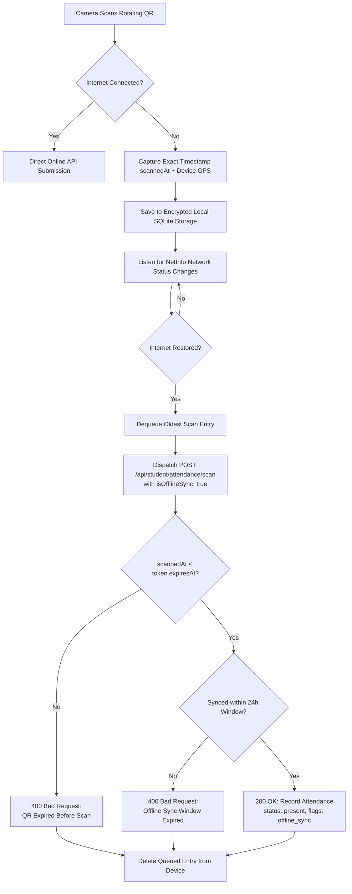

# System Architecture & Anti-Proxy Security Specification

> **Institution**: CHARUSAT (Charotar University of Science & Technology), Changa, Gujarat  
> **Engineering Team**: CHARUSAT College Development Club  
> **Primary Technology Stack**: ElysiaJS (Bun) · PostgreSQL (Prisma Multi-Schema) · Redis (BullMQ & Cache) · TanStack Router & React · React Native Expo  

---

## 1. System Overview & Monorepo Topology

The Secured Attendance System operates as a unified Turborepo monorepo designed for high throughput, low latency, and zero attendance proxying.

```text
secured_attendance/
├── apps/
│   ├── server/           # Backend API Gateway (ElysiaJS running on Bun)
│   │   ├── src/domain/   # Pure domain logic (QR token manager, attendance validator, schedule resolver)
│   │   ├── src/e2e/      # In-memory end-to-end integration test suite
│   │   ├── src/routes/   # Elysia route controllers (admin, teacher, student, auth)
│   │   └── src/services/ # Database orchestrations and business services
│   ├── web/              # Teacher & Admin Web Dashboard (TanStack Router, React 19, Tailwind CSS)
│   └── native/           # Student Mobile Application (Expo, React Native, Vision Camera)
├── packages/
│   ├── auth/             # Better-Auth server configuration & Expo authentication plugin
│   ├── db/               # Prisma multi-schema database models & client
│   ├── env/              # T3-style synchronous environment variable validation
│   ├── validators/       # Cross-platform Zod schemas shared between web, native, and server
│   └── config/           # Shared TypeScript and ESLint configurations
```

---

## 2. Anti-Proxy Attendance Security Architecture

Attendance proxying (one student marking attendance for absent peers) is eliminated through a **multi-layered physical and cryptographic defense pipeline**:



### Layer 1: Dynamic Rotating QR Tokens (HMAC-SHA256)

**The Problem**: If a teacher displays a static QR code on a projector, a student in class could take a photo, send it over WhatsApp to absent friends at the campus canteen or hostel, and let them mark proxy attendance.

**How We Fix It**:
1. **Rotating Nonce**: Every 10 seconds, the server generates a fresh random one-time code (`nonce`).
2. **Tamper-Proof Digital Stamp (HMAC)**:
   The server combines the session ID, the nonce, and the expiration time, and signs it using a secret key only the university server knows:
   ```typescript
   // Simplified logic:
   const dataToSign = `${sessionId}:${nonce}:${expiresAt}`;
   const signature = createHmac("sha256", serverSecretKey)
     .update(dataToSign)
     .digest("hex");
   ```
3. **Sliding Validity Window**: The projector updates the QR code every **10 seconds**, but the server accepts scans for up to **45 seconds** so students at the back of the classroom have enough time to focus their camera without the token expiring in their hand.
4. **Single-Use Guard (Anti-Replay)**:
   The moment a student scans a QR code, its unique `nonce` is stored in Redis with a 60-second timer. If another student tries to scan the exact same QR code, the server rejects it with `"Token already used"`.

---

### Layer 2: 1-Device-per-Student Hardware Binding

**The Problem**: A student in class brings two phones (their own and their absent roommate's) to scan the QR code twice.

**How We Fix It**:
1. On first login, the student app reads the phone's unique hardware identifier (UUID).
2. The server binds this device ID to the student's profile in the database.
3. Every time a scan is submitted, the server compares the phone's hardware ID with the bound ID in the database:
   - **Matching device**: Check-in approved.
   - **Different device**: Rejected with `403 Forbidden` (`DEVICE_MISMATCH`), and an alert is flagged for the teacher.
4. **Admin-Only Unbind**: Students cannot unbind their own phone. If a student loses their phone or buys a new one, only an institutional Super Admin can approve a rebind.

---

### Layer 3: Campus GPS Geofencing (Classroom Location)

**The Problem**: A student might try to mark attendance while sitting outside the building or at a nearby cafe.

**How We Fix It**:
1. **Why Normal Math Doesn't Work for GPS**:
   You cannot calculate GPS distance with flat geometry (Pythagoras theorem) because the Earth is a curved sphere.
   We use the **Haversine Formula**, which calculates the real surface distance in meters between two GPS coordinates:
   - Point A: Student phone GPS (`latitude`, `longitude`)
   - Point B: Classroom building center (`22.5995, 72.8205` for CMPICA Building)

   ```typescript
   // How the server calculates distance in meters:
   function calculateDistanceInMeters(lat1: number, lon1: number, lat2: number, lon2: number): number {
     const EARTH_RADIUS_METERS = 6371000;
     const toRadians = (deg: number) => (deg * Math.PI) / 180;

     const dLat = toRadians(lat2 - lat1);
     const dLon = toRadians(lon2 - lon1);

     const a =
       Math.sin(dLat / 2) * Math.sin(dLat / 2) +
       Math.cos(toRadians(lat1)) * Math.cos(toRadians(lat2)) * Math.sin(dLon / 2) * Math.sin(dLon / 2);

     const c = 2 * Math.atan2(Math.sqrt(a), Math.sqrt(1 - a));
     return EARTH_RADIUS_METERS * c; // Returns distance in meters
   }
   ```

2. **Indoor GPS Accuracy Buffer (Why We Subtract Accuracy)**:
   Inside concrete college buildings (like CMPICA Lab 301), walls weaken the GPS satellite signal. A phone's GPS might report:
   - Measured Distance: `68 meters` away from building center.
   - GPS Accuracy Margin: `±15 meters`.

   Without compensation, an honest student sitting inside Lab 301 would be wrongly rejected because the building radius is 60m.
   To be fair to students inside the classroom, we calculate the **effective distance**:
   ```typescript
   // Give the student the benefit of their phone's GPS inaccuracy:
   const effectiveDistance = Math.max(0, measuredDistance - gpsAccuracy);

   const isInsideClassroom = effectiveDistance <= buildingRadiusMeters; // e.g., 60 meters
   ```
   If `68m - 15m = 53m`, they are within the 60m boundary, so their check-in succeeds!

3. **Fake GPS / Mock Location Blocking**:
   If a student uses a "Fake GPS" app to spoof their location to CMPICA, the Android/iOS operating system marks the location fix with `mockFlag = true`.
   The server detects this flag and immediately rejects the scan with `400 Bad Request: Mock location detected`.

---

## 3. Offline Attendance Sync Protocol

In campus classrooms with thick concrete walls (such as CMPICA Lab 301) where cellular networks drop or Wi-Fi is temporarily unavailable, students can scan without being blocked. The mobile app queues the scan locally and syncs automatically once connectivity is restored.

### Sequence Diagram: Offline Capture to Cloud Sync



### State Flowchart: Lifecycle of an Offline Scan



---

### How We Handle Low Network Areas & Latency (Campus Resilience)

In real-world campus environments like CHARUSAT, classrooms often have dead spots, congested Wi-Fi access points, and weak 4G/5G signals inside concrete buildings. The system uses five defensive strategies to guarantee smooth attendance even in poor connectivity conditions:

#### 1. The 45-Second Sliding Validity Window (Latency Buffer)
- **The Challenge**: If a student's phone has high round-trip network latency (e.g., 2000ms–4000ms on a congested 2.4 GHz campus Wi-Fi) and the QR code rotated every 10 seconds, the token could expire while in transit over the network.
- **The Solution**: While the projector refreshes the visual QR every **10 seconds**, the server continues to honor each issued token for a full **45 seconds** (`validityMs: 45_000`). Even with high packet latency and camera focus delays, genuine scans are never rejected due to network lag.

#### 2. Clock Drift & Time Skew Tolerance
- **The Challenge**: A student's phone clock may be slightly out of sync with the university server's NTP clock (e.g., 5–15 seconds faster or slower).
- **The Solution**: When validating `scannedAt` timestamps for offline sync, the server applies a **clock skew tolerance margin**. Scans taken within this grace buffer are accepted, preventing false rejections caused by slight client-side clock drift.

#### 3. Sub-300 Byte Micro-Payloads (High Packet-Loss Resilience)
- **The Challenge**: Large HTTP requests often time out or drop packets in low-signal areas (like basement labs or crowded halls).
- **The Solution**: The check-in request payload is stripped down to bare cryptographic and sensor primitives:
  ```json
  {
    "sessionId": "sess-xyz",
    "nonce": "a1b2c3d4e5f60718",
    "signature": "3f8b9...",
    "expiresAt": 1789743971630,
    "gpsLat": 22.5995,
    "gpsLng": 72.8205,
    "gpsAccuracy": 12,
    "mockFlag": false,
    "deviceFingerprint": "hw-uuid-001",
    "isOfflineSync": true,
    "scannedAt": 1789743970000
  }
  ```
  At **under 300 bytes**, this payload fits comfortably inside a single TCP/IP packet, transmitting reliably even over 2G/EDGE cellular connections with packet loss rates over 30%.

#### 4. Exponential Backoff with Random Jitter (Thundering Herd Prevention)
- **The Challenge**: When 60 to 100 students walk out of a lecture hall or the classroom Wi-Fi suddenly reconnects, dozens of phones would try to flush their offline queues simultaneously, potentially causing a connection spike (thundering herd).
- **The Solution**: The mobile sync engine drains its offline queue using **exponential backoff with randomized jitter**:
  ```typescript
  // Spreads out reconnections across a jittered time window:
  const retryDelay = Math.min(baseDelay * Math.pow(2, attempt) + Math.random() * 1000, maxDelay);
  ```
  This staggers incoming requests across several seconds, ensuring the server processes all syncs smoothly without CPU or database connection pool spikes.

#### 5. Asynchronous Background Offloading (< 25ms API Response)
- **The Challenge**: Running heavy database queries, audit logging, anomaly scoring, and push notifications synchronously during peak scan periods would cause queue buildup and high latency.
- **The Solution**: The Elysia API only performs the core cryptographic and attendance validation synchronously in-memory and in PostgreSQL. Heavy background tasks are pushed to a **BullMQ Redis Queue** (`queueAuditLog`):
  - Fast-path API response: **< 25ms**
  - Background processing: Anomaly alerts, audit records, and notification jobs are handled asynchronously by background worker threads without blocking the student's mobile UI.

---

## 4. Teacher Roster Finalization with Manual Overrides

At the conclusion of a lecture:
1. The teacher clicks **Finalize Attendance** on the web dashboard.
2. The UI presents the complete enrolled roster:
   - Students scanned via QR are automatically marked **Present**.
   - Students who experienced hardware failure can be manually toggled to **Present** by the teacher.
   - Fraudulent scans can be manually overridden to **Absent**.
3. The server executes an **atomic Prisma transaction**:
   ```typescript
   await prisma.$transaction(async (tx) => {
     // 1. Close session status to "closed"
     await tx.attendanceSession.update({ where: { id: sessionId }, data: { status: "closed" } });

     // 2. Mark manually added students present with override flag
     for (const studentProfileId of manualPresentIds) {
       await tx.attendanceRecord.upsert({
         where: { sessionId_studentProfileId: { sessionId, studentProfileId } },
         create: {
           sessionId,
           studentProfileId,
           status: "present",
           isManualOverride: true,
           anomalyFlags: ["manual_teacher_override"],
         },
         update: {
           status: "present",
           isManualOverride: true,
         },
       });
     }
   });
   ```
4. An immutable audit log entry (`session.finalized_with_overrides`) is recorded.

---

## 5. Elysia Plugin Scoping Architecture

In ElysiaJS, plugins registered on sub-modules can leak lifecycle hooks to parent apps if scoped incorrectly.

To maintain strict route isolation:
- All route guards (`requireRole`, `authMacro`) are configured with `.as("scoped")`:
  ```typescript
  export function requireRole(roles: UserRole[]) {
    return new Elysia({ name: `require-role-${roles.join("-")}` })
      .onBeforeHandle(async ({ request }) => {
        const session = await auth.api.getSession({ headers: request.headers });
        if (!session) return status(401, { message: "Unauthorized" });
        const role = (session.user as { role?: string }).role as UserRole | undefined;
        if (!role || !roles.includes(role)) return status(403, { message: "Forbidden" });
      })
      .as("scoped"); // Prevents role checks from hoisting to parent router
  }
  ```
- This ensures student routes, teacher routes, and admin routes enforce role boundaries without cross-module side effects.

---

## 6. Multi-Schema Database Architecture (Prisma)

The PostgreSQL database uses schema partitioning to organize domain models:

| Schema | Models | Responsibility |
| :--- | :--- | :--- |
| `auth` | `User`, `Session`, `Account`, `Verification` | Better-Auth authentication and session tokens |
| `academic` | `Department`, `Program`, `Subject` | University academic structure |
| `attendance`| `AttendanceSession`, `AttendanceRecord` | Live sessions and verified student attendance entries |
| `campus` | `Building`, `Room` | GPS geofences and physical classroom locations |
| `profiles` | `StudentProfile`, `TeacherProfile`, `AdminProfile` | Role-specific student metadata (enrollment, device ID) |
| `timetable` | `TimetableEntry` | Weekly scheduled slots linking teachers, rooms, and divisions |
| `audit` | `AuditLog`, `AnomalyAlert` | Security event logging and proxy investigation alerts |

---

## 7. Zero-Production-Risk Test Harness

To enable students to test PRs locally and in CI without needing a running database:
- **`apps/server/src/e2e/test-setup.ts`**: Provides an in-memory database simulation using TypeScript `Map` data structures.
- **Safety Interceptor**: Intercepts Prisma client models (`prisma.user`, `prisma.attendanceSession`, `prisma.attendanceRecord`, etc.) and Redis methods (`attendanceRedis.get`, `attendanceRedis.set`, `attendanceRedis.incr`).
- **In-Process HTTP Dispatch**: Dispatches requests through Elysia's native `app.handle(new Request(...))` with zero network overhead.
- **Speed & Isolation**: All 147 unit and E2E tests execute in **~500 milliseconds** with zero external dependencies and zero risk to live databases.
